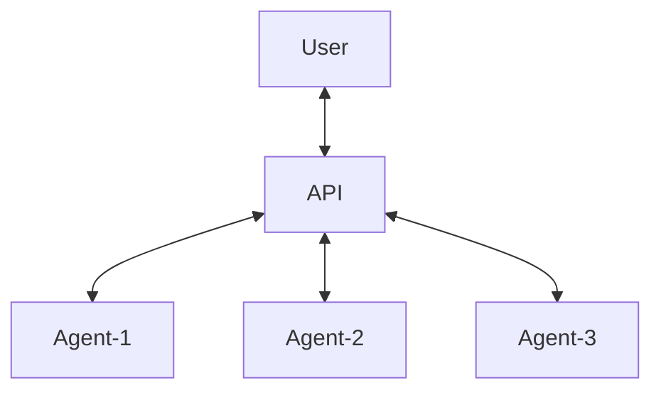

# Scraping Api

Api to scrape websites with either axios or chromium depending if js-support is needed.
This makes use of my 'scraping-api-agent' which runs a node.js server with playwright installed,
the agent runs behinh a vpn.

# TODO

- [x] Add support for multiple Agents
  - [x] When a request is incoming check the list of agents for one that is available
  - [x] Restart agents periodically to assign each a new vpn

